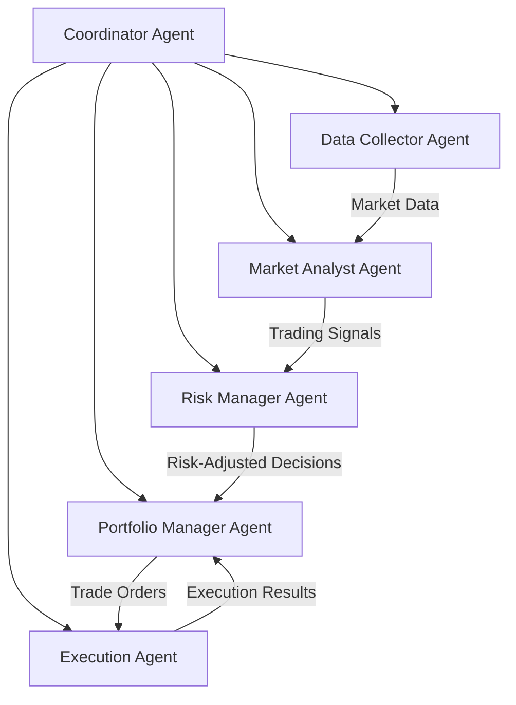

# Agentic AI Crypto Trading System

[](https://opensource.org/licenses/MIT)
[](https://www.python.org/downloads/)
[](https://github.com/yourusername/agentic-crypto-trading/stargazers)
[](https://t.me/+RI9nvUrf9pFlNzBk)

A sophisticated, multi-agent cryptocurrency trading system powered by advanced AI agents. This system implements a collaborative approach where specialized agents work together to analyze markets, manage risk, and execute trades.

## ✨ Key Features

- 🧠 **Multi-Agent Architecture**
  - Market Analysis Agent
  - Risk Management Agent
  - Portfolio Management Agent
  - Execution Agent
  - Data Collection Agent

- 📊 **Advanced Market Analysis**
  - Real-time market data processing
  - Multiple timeframe analysis
  - Technical indicator integration
  - Pattern recognition
  - Sentiment analysis support

- 🛡️ **Sophisticated Risk Management**
  - Dynamic position sizing
  - Portfolio diversification
  - Drawdown protection
  - Risk-adjusted returns optimization
  - Multi-level stop-loss system

- 📱 **Real-time Monitoring**
  - Telegram notifications
  - Trade alerts
  - Performance metrics
  - System health monitoring
  - Portfolio status updates

- 🔄 **Automated Trading**
  - Multiple exchange support
  - Order execution optimization
  - Smart order routing
  - Failed order handling
  - Network resilience

## 🚀 Getting Started

### Prerequisites

```bash
# Required Python version
Python 3.9 or higher

# Required services
Redis Server
```

### Installation

1. Clone the repository
```bash
git clone https://github.com/nimitsolanki/agentic_ai_crypto_trading.git
cd agentic_ai_crypto_trading
```

2. Create virtual environment
```bash
python -m venv venv
source venv/bin/activate  # On Windows: venv\Scripts\activate
```

3. Install dependencies
```bash
pip install -r requirements.txt
```

4. Configure environment variables
```bash
cp .env.example .env
# Edit .env with your credentials
```

5. Set up configuration
```bash
cp config/config.example.json config/config.json
# Edit config.json with your trading parameters
```

### Running the System

```bash
# Start the trading system
python main.py
```

## 📐 System Architecture



## 🔧 Configuration

The system is highly configurable through `config.json`:

```json
{
    "trading_pairs": ["BTC/USDT", "ETH/USDT"],
    "risk_management": {
        "max_position_size": 1000,
        "max_daily_loss": 100,
        "risk_per_trade": 0.02
    },
    "analysis": {
        "timeframes": ["1m", "5m", "15m", "1h"],
        "indicators": ["RSI", "MACD", "BB"]
    }
}
```

## 🔔 Notifications (Todo)

The system provides comprehensive notifications through Telegram:

- 📈 Trade signals and executions
- ⚠️ Risk alerts and warnings
- 📊 Daily performance summaries
- 🏥 System health updates
- 💰 Portfolio status reports

## 🤝 Contributing (Todo)

We welcome contributions! Please see our [Contributing Guide](CONTRIBUTING.md) for details.

1. Fork the repository
2. Create your feature branch
3. Commit your changes
4. Push to the branch
5. Open a Pull Request

## 📝 Documentation (Todo)

Detailed documentation is available in the [docs](docs/) directory: 

- [System Architecture](docs/architecture.md)
- [Agent Documentation](docs/agents.md)
- [Configuration Guide](docs/configuration.md)
- [API Reference](docs/api.md)
- [Trading Strategies](docs/strategies.md)

## 📊 Performance

The system includes comprehensive performance tracking:

- Win rate and profit metrics
- Risk-adjusted returns
- Drawdown analysis
- Trading journal
- Performance visualization

## 🔒 Security (Todo)

- Secure API key management
- Rate limiting protection
- Error handling and recovery
- Network resilience
- Data encryption

## 📜 License

This project is licensed under the MIT License - see the [LICENSE](LICENSE) file for details.

## 🌟 Star History

[](https://star-history.com/#yourusername/agentic-crypto-trading&Date)

## 🙏 Acknowledgements

- [CCXT](https://github.com/ccxt/ccxt) for exchange connectivity
- [Pandas](https://pandas.pydata.org/) for data analysis
- [python-telegram-bot](https://python-telegram-bot.org/) for notifications

## 📧 Contact

- Create an issue for bug reports or feature requests
- Join our [Telegram group](https://t.me/+RI9nvUrf9pFlNzBk) for discussions

## ⚠️ Disclaimer

This software is for educational purposes only. Cryptocurrency trading carries significant risks. Use at your own risk.

## 🌟 Show your support

Give a ⭐️ if this project helped you!
